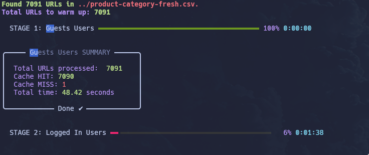
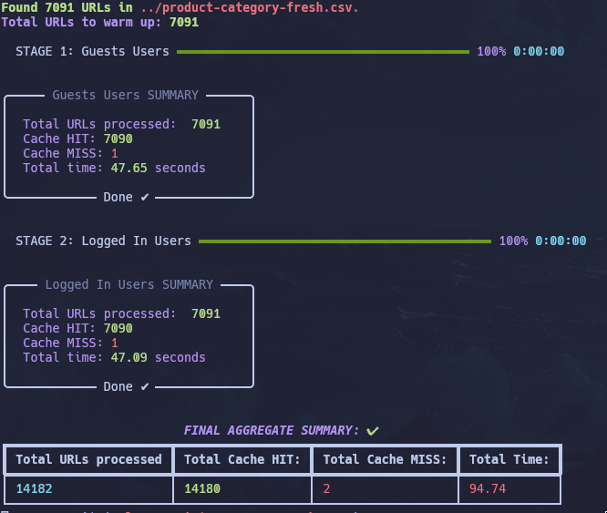

# 🚀 URL Cache Warmer

A Python script to warm up URLs and check cache performance by sending GET requests in parallel.

## 📋 Overview

This tool sends HTTP GET requests to a list of URLs to warm up the cache and determine whether the responses come from cache (**HIT**) or are fresh requests (**MISS**). It supports multiple configuration profiles to test different headers and cookies.




## ⚙️ Requirements

- Python 3.6+
- Required Python packages (install with `pip install -r requirements.txt`):
  - `requests` 🌐
  - `rich` 🎨
  - `concurrent.futures` ⚡

## 🚀 Usage

### 🛠️ Command Line Arguments

```bash
python warmer.py --files <csv_file1> [<csv_file2> ...] [--threads <number_of_threads>] [--timeout <timeout_in_seconds>]
```

| Parameter | Description | Default |
|-----------|-------------|---------|
| `--files` | One or more CSV files containing URLs to warm up (required) | - |
| `--threads` | Number of threads to use for parallel requests | 5 |
| `--timeout` | Time to wait for the response to be completed | 10 |

### 📄 Configuration File

The script expects a `config.json` file in the current directory with the following structure:

```json
[
  {
    "name": "Configuration 1",
    "headers": {
      "User-Agent": "CacheWarmer/1.0"
    },
    "cookies": {
      "session_id": "abc123"
    }
  },
  {
    "name": "Configuration 2",
    "headers": {
      "Authorization": "Bearer token123"
    },
    "cookies": {}
  }
]
```

Each configuration object can define:
- `name`: A descriptive name for the configuration
- `headers`: HTTP headers to include in requests
- `cookies`: HTTP cookies to include in requests

### 📋 CSV File Format

Each CSV file should contain one URL per line in the first column:

```csv
https://example.com/page1
https://example.com/page2
https://example.com/page3
```

### 📝 Log Files

Logs are written to `warmer.log` pointing all execution errors. No separate log files are created by default. If you need to redirect logs to a file, you can do so using shell redirection:

```bash
python warmer.py --files urls.csv > app.log 2>&1
```

## 📊 Output

The script displays:
1. 📈 Progress bars for each configuration stage
2. 📊 Summary panels for each configuration
3. 📋 Final aggregate summary table

## 🧪 Example

```bash
python warmer.py --files urls.csv --threads 10 --timeout 15
```

This will:
- Read URLs from `urls.csv`
- Warm up each URL using 10 parallel threads
- Apply configurations from `config.json`
- Show progress and results in the terminal

## 🎯 Features

- **Parallel Processing**: Efficiently test multiple URLs simultaneously
- **Configurable Headers**: Test different HTTP headers and cookies
- **Visual Progress**: Real-time progress indicators with rich UI
- **Detailed Reporting**: Clear HIT/MISS distinction and performance metrics
- **Flexible Input**: Support for multiple CSV files and configurations

## 📈 Performance Metrics

| Metric | Description |
|--------|-------------|
| **HIT** | Response served from cache |
| **MISS** | Fresh request made to origin server |
| **Latency** | Time taken for response |
| **Success Rate** | Percentage of successful requests |

## 🛡️ Security Note

⚠️ This tool is for testing and development purposes only. Ensure you have proper authorization before testing external systems.
